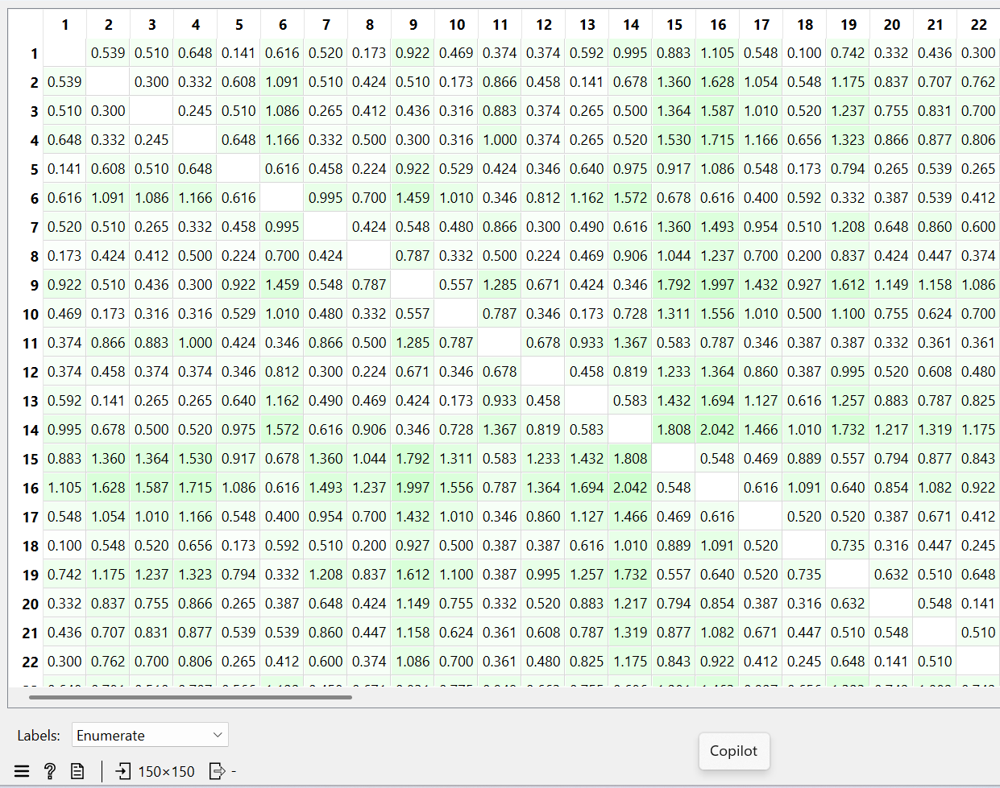
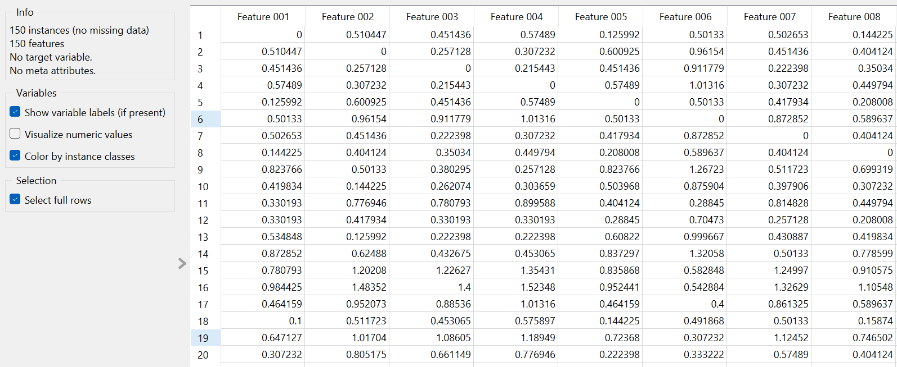

# Distance in Iris Data

# Mengukur Jarak Tipe Data Numerik

Mengukur jarak adalah komponen utama dalam algoritma clustering berbasis jarak. Pada Dataset Iris ini atribut/fitur bertipe data numerik, jadi jarak bisa diukur menggunakan Manhattan Distance, Euclidean Distance, Minkwoski Distance. 

### Implementasi Menggunakan Euclidean Distance

Euclidean Distance digunakan untuk mengukur jarak tipe data numerik dan paling umum di pakai. Dataset Iris yang akan diukur menggunakan Euclidean Distance ini terdiri dari 150 data bunga, 4 atribut numerik yaitu sepal_length, sepal_width, petal_length, petal_width.

Setiap atribut direpresentasikan sebagai vektor berdimensi 4:

$$
x = (x_1, x_2, x_3, x_4)
$$

Rumus Euclidean Distance yang digunakan adalah:

$$
d(x,y) = \sqrt{
(x_1 - y_1)^2 +
(x_2 - y_2)^2 +
(x_3 - y_3)^2 +
(x_4 - y_4)^2
}
$$

Sebagai ilustrasi, digunakan dua data pertama pada dataset Iris.

Data ke-1:

$$
x_1 = (5.1, 3.5, 1.4, 0.2)
$$

Data ke-2:

$$
x_2 = (4.9, 3.0, 1.4, 0.2)
$$

Langkah perhitungan:

$$
d(x_1,x_2) =
\sqrt{
(5.1 - 4.9)^2 +
(3.5 - 3.0)^2 +
(1.4 - 1.4)^2 +
(0.2 - 0.2)^2
}
$$

$$
=
\sqrt{
(0.2)^2 +
(0.5)^2 +
(0)^2 +
(0)^2
}
$$

$$
=
\sqrt{
0.04 + 0.25 + 0 + 0
}
$$

$$
=
\sqrt{0.29}
$$

$$
\approx 0.538
$$

Penjelasan :

Hasil perhitungan menunjukkan bahwa jarak antara data pertama dan data kedua sekitar 0.538. Nilai ini menunjukkan tingkat kemiripan kedua sampel, yaitu dimana semakin kecil nilai jarak maka semakin tingkat kemiripan tinggi.

#### Pembentukan Matriks Jarak

Setelah menghitung jarak antar pasangan data menggunakan Euclidean Distance, langkah berikutnya adalah menyusun nilai - nilai tersebut ke dalam suatu matriks jarak (distance matrix).

Secara umum, jika terdapat $n$ data, maka matriks jarak
yang terbentuk berukuran:

$$
n \times n
$$

Karena dataset Iris terdiri dari 150 data, maka
ukuran matriks jaraknya adalah:

$$
150 \times 150
$$

Sebagai ilustrasi, misalkan diambil tiga data pertama
dari dataset Iris:

$$
x_1 = (5.1, 3.5, 1.4, 0.2)
$$

$$
x_2 = (4.9, 3.0, 1.4, 0.2)
$$

$$
x_3 = (4.7, 3.2, 1.3, 0.2)
$$

Diasumsikan hasil perhitungan jaraknya menggunakan Rumus Euclidean tadi, yaitu :

$$
d(x_1,x_2) = 0.538
$$

$$
d(x_1,x_3) = 0.510
$$

$$
d(x_2,x_3) = 0.300
$$

Maka matriks jarak yang terbentuk adalah:

$$
D =
\begin{bmatrix}
0 & 0.538 & 0.510 \\
0.538 & 0 & 0.300 \\
0.510 & 0.300 & 0
\end{bmatrix}
$$

Pada distance matriks terdapat elemen yang memiliki nilai 0, itu karena jarak suatu data terhadap dirinya sendiri adalah 0. Matriks bersifat simestris, yaitu :

$$
d(x_i,x_j) = d(x_j,x_i)
$$

Matriks jarak ini merepresentasikan tingkat kemiripan antar seluruh data.
Semakin kecil nilai pada matriks, maka semakin mirip kedua data tersebut.
Berikut implementasi dari orange yang menghasilkan matriks jarak lengkap berukuran $150 \times 150$.

### Implementasi Menggunakan Manhattan Distance

Manhattan Distance merupakan metode pengukuran jarak yang menghitung jumlah elisih absolut antar atribut pada dua data.

Rumus Manhattan Distance :

$$
d(x,y) = \sum_{i=1}^{n} |x_i - y_i|
$$

Karena dataset iris memiliki 4 atribut numerik, maka rumusnya diperoleh menjadi :

$$
d(x,y) =
|x_1 - y_1| +
|x_2 - y_2| +
|x_3 - y_3| +
|x_4 - y_4|
$$

Contoh implementasi perhitungan Manhattan Distance menggunakan dua data pertama pada dataset iris. 

Data ke-1:

$$
x_1 = (5.1, 3.5, 1.4, 0.2)
$$

Data ke-2:

$$
x_2 = (4.9, 3.0, 1.4, 0.2)
$$

Perhitungan jaraknya :

$$
d(x_1,x_2) =
|5.1 - 4.9| +
|3.5 - 3.0| +
|1.4 - 1.4| +
|0.2 - 0.2|
$$

$$
=
0.2 + 0.5 + 0 + 0
$$

$$
=
0.7
$$

Hasil perhitungan tersebut menunjukkan bahwa jarak Manhattan antara data pertama dan data kedua adalah 0.7. 

Seperti pada Euclidean Distance, nilai Manhattan Distance
yang telah dihitung kemudian disusun dalam bentuk matriks jarak.

Jika terdapat $n$ data, maka ukuran matriks jaraknya adalah:

$$
n \times n
$$

Untuk dataset Iris lengkap:

$$
150 \times 150
$$

Sebagai ilustrasi, misalkan digunakan tiga data pertama.

Diketahui hasil perhitungan:

$$
d(x_1,x_2) = 0.7
$$

$$
d(x_1,x_3) = 0.6
$$

$$
d(x_2,x_3) = 0.5
$$

#### Pembentukan Matriks Jarak

$$
D =
\begin{bmatrix}
0 & 0.7 & 0.6 \\
0.7 & 0 & 0.5 \\
0.6 & 0.5 & 0
\end{bmatrix}
$$

Sama dengan Euclidean Distance, elemen diagonal bernilai 0 karena jarak terhadap dirinya sendiri adalah 0.

Manhattan Distance lebih sederhana dibandingkan Euclidean Distance
karena tidak menggunakan akar kuadrat.
Metode ini sering digunakan pada data berdimensi tinggi
atau ketika ingin mengurangi pengaruh nilai ekstrem (outlier).

Dalam implementasi sebenarnya, seluruh pasangan data
akan dihitung secara otomatis menggunakan orange,
sehingga terbentuk matriks jarak berukuran $150 \times 150$.

### Implementasi Menggunakan Minkowski Distance

Minkowski Distance merupakan generalisasi dari Euclidean Distance
dan Manhattan Distance. Metode ini menggunakan parameter $p$
untuk menentukan jenis jarak yang dihasilkan.

Rumus Minkowski Distance adalah:

$$
d(x,y) =
\left(
\sum_{i=1}^{n} |x_i - y_i|^p
\right)^{\frac{1}{p}}
$$

Jika dataset memiliki 4 atribut seperti pada Iris,
maka rumusnya menjadi:

$$
d(x,y) =
\left(
|x_1 - y_1|^p +
|x_2 - y_2|^p +
|x_3 - y_3|^p +
|x_4 - y_4|^p
\right)^{\frac{1}{p}}
$$

\subsection*{Hubungan dengan Metode Lain}

Jika:

$$
p = 1
$$

maka Minkowski Distance sama dengan Manhattan Distance.

Jika:

$$
p = 2
$$

maka Minkowski Distance sama dengan Euclidean Distance.

Sebagai ilustrasi digunakan dua data pertama
pada dataset Iris.

Data ke-1:

$$
x_1 = (5.1, 3.5, 1.4, 0.2)
$$

Data ke-2:

$$
x_2 = (4.9, 3.0, 1.4, 0.2)
$$

Misalkan digunakan parameter:

$$
p = 3
$$

Maka perhitungannya adalah:

$$
d(x_1,x_2) =
\left(
|5.1 - 4.9|^3 +
|3.5 - 3.0|^3 +
|1.4 - 1.4|^3 +
|0.2 - 0.2|^3
\right)^{\frac{1}{3}}
$$

$$
=
\left(
(0.2)^3 +
(0.5)^3 +
0 +
0
\right)^{\frac{1}{3}}
$$

$$
=
\left(
0.008 + 0.125
\right)^{\frac{1}{3}}
$$

$$
=
(0.133)^{\frac{1}{3}}
$$

$$
\approx 0.509
$$

Hasil tersebut menunjukkan bahwa jarak Minkowski
dengan $p=3$ antara dua data tersebut adalah sekitar 0.509.

#### Pembentukan Matriks Jarak

Seperti metode sebelumnya, nilai Minkowski Distance
disusun dalam bentuk matriks jarak.

Jika terdapat $n$ data, maka ukuran matriks jaraknya adalah:

$$
n \times n
$$

Untuk dataset Iris lengkap:

$$
150 \times 150
$$

Sebagai ilustrasi untuk tiga data pertama,
misalkan diperoleh hasil:

$$
d(x_1,x_2) = 0.509
$$

$$
d(x_1,x_3) = 0.480
$$

$$
d(x_2,x_3) = 0.420
$$

Maka matriks jarak yang terbentuk adalah:

$$
D =
\begin{bmatrix}
0 & 0.509 & 0.480 \\
0.509 & 0 & 0.420 \\
0.480 & 0.420 & 0
\end{bmatrix}
$$

Parameter $p$ mempengaruhi sensitivitas terhadap perbedaan atribut.
Semakin besar nilai $p$, maka perbedaan yang besar pada suatu atribut
akan memberikan pengaruh yang lebih signifikan terhadap nilai jarak.

Dalam implementasi menggunakan orange,
seluruh pasangan data akan dihitung secara otomatis
untuk membentuk matriks jarak berukuran $150 \times 150$.

