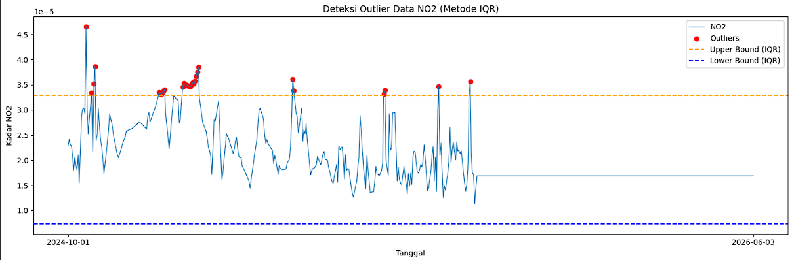
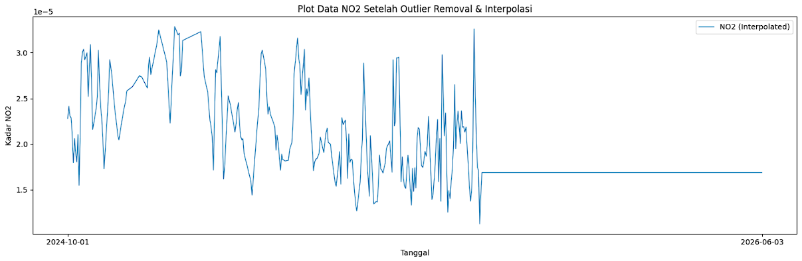
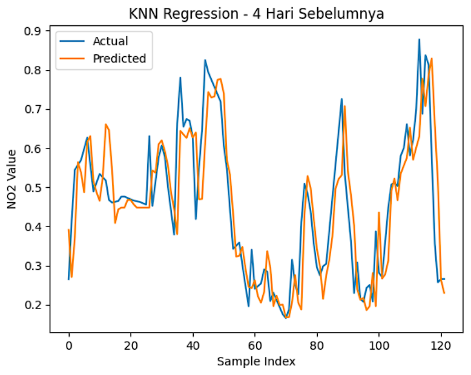
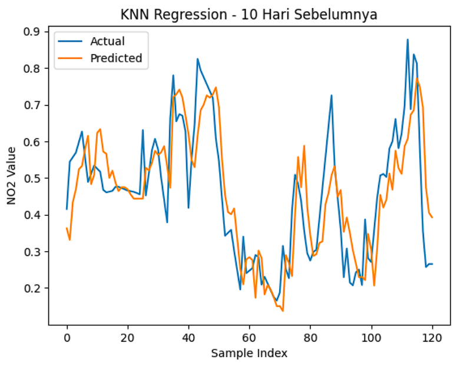

# Peramalan kadar $NO_2$ di daerah Bangkalan Madura (revisi)

## Latar Belakang

Peningkatan aktivitas industri, transportasi, serta pertumbuhan populasi yang pesat telah menyebabkan peningkatan signifikan terhadap tingkat pencemaran udara di berbagai wilayah. Salah satu polutan udara utama yang menjadi perhatian adalah Nitrogen Dioksida (NO₂), yaitu gas beracun yang dihasilkan terutama dari proses pembakaran bahan bakar fosil seperti kendaraan bermotor, pembangkit listrik, dan kegiatan industri. NO₂ memiliki dampak serius terhadap kesehatan manusia, seperti gangguan pernapasan, iritasi paru-paru, serta memperburuk penyakit asma dan bronkitis. Selain itu, NO₂ juga berkontribusi terhadap pembentukan hujan asam dan penurunan kualitas lingkungan secara keseluruhan.

## 1. Pengumpulan Data

Kita install terlebih dahulu openoneo:
```bash
pip install openeo

```

Lalu tuliskan code dibawah:

```python
import openeo

```

```python
connection = openeo.connect("openeo.dataspace.copernicus.eu").authenticate_oidc()

```

pada saat menjalankan baris code diatas (connection), nanti akan diminta authentikasi seperti output berikut:

```text
Terminal/Output
Visit [https://identity.dataspace.copernicus.eu/auth/realms/CDSE/device?user_code=TSVQ-EUMA](https://identity.dataspace.copernicus.eu/auth/realms/CDSE/device?user_code=TSVQ-EUMA) to authenticate.
✅ Authorized successfully
Authenticated using device code flow.

```

Kalian tinggal klik link authentikasi lalu login menggunakan akun "copernicus" kalian.

```python
aoi = {
    "type": "Polygon",
    "coordinates": [
        [
            [113.09, -6.89],
            [112.68, -6.89],
            [112.68, -7.20],
            [113.09, -7.20],
            [113.09, -6.89],
        ]
    ]
}

s5post = connection.load_collection(
    "SENTINEL_5P_L2",
    temporal_extent=["2024-10-01", "2026-06-03"],
    spatial_extent={
        "west": 112.68,
        "south": -7.20,
        "east": 113.09,
        "north": -6.89
    },
    bands=["NO2"],
)

# Now aggregate by day to avoid having multiple data per day
s5p_no2_daily = s5post.aggregate_temporal_period(reducer="mean", period="day")

# Now create a spatial aggregation to generate mean timeseries data
s5p_no2_aoi = s5p_no2_daily.aggregate_spatial(reducer="mean", geometries=aoi)

```

Di panel sebelah kanan terdapat data JSON yang berupa koordinat daerah yang kalian pilih, kalian salin terus sesuaikan dengan code diatas di bagian variabel "aoi" dan spatial_extent.

Lalu kalian tambahkan baris code dibawah untuk memulai pengambilan data:

```python
job = s5post.execute_batch(title="NO2 in Bangkalan terkini", outputfile="NO2Bangkalan Terkini.nc")

```

Tunggu proses pengambilan data, output proses seperti berikut:

```text
0:00:00 Job 'j-26060301180245c884e46cb43e117ee7': send 'start'
0:00:06 Job 'j-26060301180245c884e46cb43e117ee7': queued (progress 0%)
0:00:11 Job 'j-26060301180245c884e46cb43e117ee7': queued (progress 0%)
0:00:17 Job 'j-26060301180245c884e46cb43e117ee7': queued (progress 0%)
0:00:25 Job 'j-26060301180245c884e46cb43e117ee7': queued (progress 0%)
0:00:35 Job 'j-26060301180245c884e46cb43e117ee7': queued (progress 0%)
0:00:48 Job 'j-26060301180245c884e46cb43e117ee7': queued (progress 0%)
0:01:03 Job 'j-26060301180245c884e46cb43e117ee7': queued (progress 0%)
0:01:22 Job 'j-26060301180245c884e46cb43e117ee7': running (progress N/A)
0:01:46 Job 'j-26060301180245c884e46cb43e117ee7': running (progress N/A)
0:02:16 Job 'j-26060301180245c884e46cb43e117ee7': running (progress N/A)
0:02:53 Job 'j-26060301180245c884e46cb43e117ee7': running (progress N/A)
0:03:40 Job 'j-26060301180245c884e46cb43e117ee7': running (progress N/A)
0:04:39 Job 'j-26060301180245c884e46cb43e117ee7': running (progress N/A)
0:05:39 Job 'j-26060301180245c884e46cb43e117ee7': running (progress N/A)
0:06:39 Job 'j-26060301180245c884e46cb43e117ee7': finished (progress 100%)

```

Abaikan ketika ada N/A.

Ketika proses pengambilan data, aktivitas kalian akan terekam di halaman https://editor.openeo.org/?server=https%3A%2F%2Fopeneo.dataspace.copernicus.eu%2Fopeneo%2F1.2. Disitu terdapat nama dataset dan status pengambilan data.

## 2. Preproccessing Data

Setelah kita mengambil data. File akan berbentuk .nc. Kita cuman perlu kolom date dan NO2 menggunakan code dibawah. Pastikan library `netCDF4` sudah ter-install.

```bash
pip install netCDF4

```

```python
import netCDF4

file_path = "NO2Bangkalan Terkini.nc"
ds = netCDF4.Dataset(file_path)

# Lihat seluruh variabel yang tersedia
print("📦 Variabel dalam file:")
print(ds.variables.keys())
# dict_keys(['t', 'x', 'y', 'crs', 'NO2'])

# Ambil NO2
no2 = ds.variables["NO2"][:]

# Ambil Time
time = ds.variables["t"][:]

# Konversi waktu ke format tanggal jika punya atribut 'units'
try:
    time_units = ds.variables["t"].units
    dates = netCDF4.num2date(time, units=time_units)
except Exception:
    dates = time  # fallback kalau tidak ada units

# Tampilkan struktur data NO2
print(type(no2))
# type <class 'numpy.ma.MaskedArray'>

print(len(no2))
# banyaknya data record NO2: 607

print(len(no2[0]))
# panjang data perbaris: 9

print(len(no2[0][0]))
# panjang perdata: 8

```

Dari code diatas kita mengetahui bentuk data dari kolom NO2 nya Untuk melihat 10 data pertama adalah:

```python
print("Contoh data pertama:")
for i in range(0, 10):
    print(no2[i])

```

Dalam sehari, terdapat banyak data NO2, jadi kita rata-ratakan agar satu cell data hanya terdapat satu value. Namun terdapat masalah pada data NO2 seperti missing value.

### a. Mengatasi Missing Value menggunakan metode Interpolasi Linear

Sekarang kita akan mengatasi permasalahan missing value pada data NO2.

```python
import numpy as np
import pandas as pd

# Interpolasi Linear
no2_filled = np.zeros_like(no2)
# Untuk jaga-jaga jika terdapat '--' tidak berubah menjadi 0
no2_filled = no2_filled.filled(0)

# loop tiap grid (y,x)
for i in range(no2.shape[1]):     # 9 baris
    for j in range(no2.shape[2]): # 8 kolom
        series = pd.Series(no2[:, i, j])
        no2_filled[:, i, j] = series.interpolate(method='linear', limit_direction='both').to_numpy()

```

Dengan code diatas, missing value yang terdapat pada data NO2 akan diisi secara otomatis menggunakan metode Interpolasi Linear.

### b. Rata-rata kan Data dan ubah Datetime

Setelah mengatasi missing value, kita akan me-rata-rata-kan data NO2 agar satu record hanya berupa single value. Sekalian kita mengambil date nya dan menaruh di array. Kita akan mengubah datetime menjadi format yang sesuai untuk data harian.

```python
new_dates = []
new_no2 = []
for i in range(len(dates)):
    # ubah format datetime
    new_date = dates[i].strftime('%Y-%m-%d')
    new_dates.append(new_date)
    new_no2.append(np.mean(no2_filled[i]))

```

### c. Simpan data dalam bentuk CSV

Setelah itu kita akan membentuk data menjadi DataFrame Pandas untuk disimpan menjadi CSV.

```python
df = pd.DataFrame({
    "date": dates,
    "NO2": new_no2
})

# Simpan ke CSV
df.to_csv("NO2_Bangkalan_timeseries_terkini.csv", index=False)

```

Untuk mengatasi missing value awal dan menyimpan data ke CSV sudah berhasil.

### d. Pengecekan Missing Value data harian pada CSV

Sekarang setelah data berbentuk CSV, kita cek apakah data Time Series harian lengkap. Cara men-cek apakah data Time Series Harian lengkap gunakan code dibawah:

```python
import pandas as pd
import numpy as np

df = pd.read_csv("NO2_Bangkalan_timeseries_terkini.csv")

# Pastikan kolom 'date' bertipe datetime
df['date'] = pd.to_datetime(df['date'])

# Buat rentang tanggal lengkap
start_date = "2024-10-01"
end_date = "2026-06-03"
full_range = pd.date_range(start=start_date, end=end_date, freq='D')

# Cek tanggal yang hilang
missing_dates = full_range.difference(df['date'])

print(f"Jumlah hari missing: {len(missing_dates)}")
print("Daftar tanggal missing:")
print(missing_dates)

```

```text
output/terminal
Jumlah hari missing: 4
Daftar tanggal missing:
DatetimeIndex(['2025-01-30', '2025-01-31', '2026-02-24', '2026-06-03'], dtype='datetime64[ns]', freq=None)

```

Dalam kasus data terbaru ini, terdapat 4 hari missing value. Kita akan mengatasi lagi missing value menggunakan metode Interpolasi Linear. Cara memperbaikinya gunakan code dibawah:

```python
import pandas as pd

# Pastikan datetime dan sorting
df['date'] = pd.to_datetime(df['date'])
df = df.sort_values('date')

# Buat rentang tanggal lengkap
full_range = pd.date_range(start="2024-10-01", end="2026-06-03", freq='D')

# Reindex agar tanggal yang hilang muncul sebagai NaN
df = df.set_index('date').reindex(full_range)
df.index.name = 'date'

# Interpolasi linear berdasarkan indeks waktu
df['NO2'] = df['NO2'].interpolate(method='time')

# (Opsional) jika masih ada NaN di bagian awal/akhir bisa gunakan forward/backward fill
df['NO2'] = df['NO2'].fillna(method='bfill').fillna(method='ffill')

# Simpan kembali ke CSV
df.to_csv("no2_timeseries_interpolated_terkini.csv")

```

### e. Deteksi Outlier IQR

Setelah kita mengisi missing value menggunakan metode Interpolasi Linear, selanjutnya kita akan mendeteksi Outlier menggunakan metode IQR pada data hasil penggabungan.

```python
import pandas as pd
import numpy as np
import matplotlib.pyplot as plt

df = pd.read_csv("no2_timeseries_interpolated_terkini.csv")

df['date'] = pd.to_datetime(df['date'])

# Hitung IQR
Q1 = df['NO2'].quantile(0.25)
Q3 = df['NO2'].quantile(0.75)
IQR = Q3 - Q1

lower_bound = Q1 - 1.5 * IQR
upper_bound = Q3 + 1.5 * IQR

# Filter outlier
outliers_iqr = df[(df['NO2'] < lower_bound) | (df['NO2'] > upper_bound)]

print("Jumlah Outlier (IQR):", len(outliers_iqr))
print(outliers_iqr[['date', 'NO2']].head())

```

```text
output/terminal
Jumlah Outlier (IQR): 31
         date       NO2
16 2024-10-17  0.000047
21 2024-10-22  0.000033
23 2024-10-24  0.000035
24 2024-10-25  0.000039
81 2024-12-21  0.000033

```

Untuk men-visualisasi outlier:

```python
# === Visualisasi ===
plt.figure(figsize=(15,5))
plt.plot(df['date'], df['NO2'], label="NO2", linewidth=1)

# Titik Outlier
plt.scatter(outliers_iqr['date'], outliers_iqr['NO2'], 
            color='red', marker='o', label="Outliers")

# Garis batas atas & bawah
plt.axhline(upper_bound, color='orange', linestyle='dashed', label="Upper Bound (IQR)")
plt.axhline(lower_bound, color='blue', linestyle='dashed', label="Lower Bound (IQR)")

plt.title("Deteksi Outlier Data NO2 (Metode IQR)")
plt.xlabel("Tanggal")
plt.ylabel("Kadar NO2")
plt.legend()
plt.tight_layout()
plt.xticks(
    ticks=[df['date'].iloc[0], df['date'].iloc[-1]],
    labels=[df['date'].iloc[0].strftime('%Y-%m-%d'),
            df['date'].iloc[-1].strftime('%Y-%m-%d')]
)
plt.show()

```



Setelah itu, kita akan menghapus data outlier. Karena data ini merupakan data Time Series, maka data outlier yang dihapus akan diisi kembali menggunakan Interpolasi Linear.

```python
# Tandai outlier menjadi NaN
df['NO2_cleaned'] = df['NO2'].mask((df['NO2'] < lower_bound) | (df['NO2'] > upper_bound))

print("Jumlah nilai yang dinyatakan sebagai outlier:", df['NO2_cleaned'].isna().sum())

# Interpolasi linear untuk mengisi kembali nilai outlier
df['NO2_filled'] = df['NO2_cleaned'].interpolate(method='linear')

# Jika masih tersisa NaN di ujung data, isi dengan forward/backward fill
df['NO2_filled'] = df['NO2_filled'].bfill()
# df['NO2_filled'] = df['NO2_filled'].fillna(method='bfill').fillna(method='ffill')

print("Jumlah missing setelah interpolasi:", df['NO2_filled'].isna().sum())

```

```text
output/terminal
Jumlah nilai yang dinyatakan sebagai outlier: 31
Jumlah missing setelah interpolasi: 0

```

Visualisasi data setelah menghapus Outlier dan mengisi kembali menggunakan Interpolasi Linear:

```python
plt.figure(figsize=(15,5))
# Plot data hasil interpolasi
plt.plot(df['date'], df['NO2_filled'], label="NO2 (Interpolated)", linewidth=1)
# Tampilkan hanya tanggal awal dan akhir di sumbu X
plt.xticks(
    ticks=[df['date'].iloc[0], df['date'].iloc[-1]],
    labels=[df['date'].iloc[0].strftime('%Y-%m-%d'),
            df['date'].iloc[-1].strftime('%Y-%m-%d')]
)
plt.title("Plot Data NO2 Setelah Outlier Removal & Interpolasi")
plt.xlabel("Tanggal")
plt.ylabel("Kadar NO2")
plt.legend()
plt.tight_layout()
plt.show()

```



## 3. Modelling

Dengan data Time Series kadar NO2 harian di daerah Bangkalan, kita akan memprediksi kadar NO2 satu hari yang akan datang. Sekarang kita akan ubah data, mencoba mencari korelasi antara 1 hari dengan 4 hari sebelumnya. Kita juga akan membandingkan apakah semakin banyak hari sebelumnya, model akan lebih bagus?

### a. uji korelasi

```python
import pandas as pd
from sklearn.preprocessing import StandardScaler

def create_supervised(data, n_lag=4):
    df_supervised = pd.DataFrame()

    # Membuat fitur t-4 sampai t-1
    for i in range(n_lag, 0, -1):
        df_supervised[f'NO2(t-{i})'] = data.shift(i)

    # Label hari H
    df_supervised['NO2(t)'] = data

    # Hapus baris yang masih mengandung NaN akibat shift
    df_supervised.dropna(inplace=True)

    return df_supervised

# Scale the NO2_filled data
scaler = StandardScaler()
df['NO2_scaled'] = scaler.fit_transform(df['NO2_filled'].values.reshape(-1, 1))

# contoh penggunaan
supervised_df30 = create_supervised(df['NO2_scaled'], n_lag=30)

# Ambil semua lag dan kolom target
lag_cols = supervised_df30.drop(columns="NO2(t)").columns
correlations = supervised_df30[lag_cols].corrwith(supervised_df30['NO2(t)'])

# Tampilkan nilai korelasi
print(correlations)

```

```text
output/terminal

NO2(t-30)    0.313437
NO2(t-29)    0.333162
NO2(t-28)    0.355497
NO2(t-27)    0.354278
NO2(t-26)    0.340605
NO2(t-25)    0.325570
NO2(t-24)    0.310233
NO2(t-23)    0.304656
NO2(t-22)    0.304531
NO2(t-21)    0.304638
NO2(t-20)    0.304368
NO2(t-19)    0.310469
NO2(t-18)    0.320158
NO2(t-17)    0.334370
NO2(t-16)    0.350005
NO2(t-15)    0.364408
NO2(t-14)    0.382672
NO2(t-13)    0.400678
NO2(t-12)    0.413531
NO2(t-11)    0.442313
NO2(t-10)    0.483143
NO2(t-9)     0.509766
NO2(t-8)     0.533202
NO2(t-7)     0.547421
NO2(t-6)     0.566128
NO2(t-5)     0.601998
NO2(t-4)     0.649300
NO2(t-3)     0.717091
NO2(t-2)     0.799373
NO2(t-1)     0.903598
dtype: float64
```

### b. Normalisasi Data

menggunakan min-max scaler

```python
from sklearn.preprocessing import MinMaxScaler
import pandas as pd

scaler = MinMaxScaler()

df['NO2_scaled'] = scaler.fit_transform(df[['NO2']])

```

### c. Mengubah Data

Sekarang saya ingin mengubah data dari sebelumnya hanya 2 fitru menjadi 4 hari sebelum yang terdapat 5 fitur (t-4, t-3, t-2, t-1, dan t sebagai label) karena dari uji korelasi, keempat fitur tersebut (t-1 sampai t-4) merupakan nilai uji korelasi terbaik (lebih dari 0.5). Saya juga membuat data 10 hari sebelum untuk membandingkan apakah semakin banyak hari sebelum, semakin baik pula modelnya?

```python
supervised_df = create_supervised(df['NO2_scaled'], n_lag=4)

print(supervised_df)
print(supervised_df.shape)

```

```text
output/terminal

     NO2(t-4)  NO2(t-3)  NO2(t-2)  NO2(t-1)    NO2(t)
4    0.326641  0.364727  0.335015  0.328510  0.271637
5    0.364727  0.335015  0.328510  0.271637  0.189721
6    0.335015  0.328510  0.271637  0.189721  0.265051
7    0.328510  0.271637  0.189721  0.265051  0.222921
8    0.271637  0.189721  0.265051  0.222921  0.192101
..        ...       ...       ...       ...       ...
606  0.877560  0.687542  0.837156  0.812341  0.578370
607  0.687542  0.837156  0.812341  0.578370  0.355028
608  0.837156  0.812341  0.578370  0.355028  0.256983
609  0.812341  0.578370  0.355028  0.256983  0.265315
610  0.578370  0.355028  0.256983  0.265315  0.265315

[607 rows x 5 columns]
(607, 5)

```

Untuk membuat data 10 hari sebelum tinggal tambah code dibawah (ubah parameter n_lag).

```python
supervised_df10 = create_supervised(df['NO2_scaled'], n_lag=10)

print(supervised_df10)
print(supervised_df10.shape)
```

```text
output/terminal

   NO2(t-10)  NO2(t-9)  NO2(t-8)  NO2(t-7)  NO2(t-6)  NO2(t-5)  NO2(t-4)  \
10    0.326641  0.364727  0.335015  0.328510  0.271637  0.189721  0.265051   
11    0.364727  0.335015  0.328510  0.271637  0.189721  0.265051  0.222921   
12    0.335015  0.328510  0.271637  0.189721  0.265051  0.222921  0.192101   
13    0.328510  0.271637  0.189721  0.265051  0.222921  0.192101  0.276935   
14    0.271637  0.189721  0.265051  0.222921  0.192101  0.276935  0.119160   
..         ...       ...       ...       ...       ...       ...       ...   
606   0.579870  0.599825  0.660784  0.581097  0.620900  0.697317  0.877560   
607   0.599825  0.660784  0.581097  0.620900  0.697317  0.877560  0.687542   
608   0.660784  0.581097  0.620900  0.697317  0.877560  0.687542  0.837156   
609   0.581097  0.620900  0.697317  0.877560  0.687542  0.837156  0.812341   
610   0.620900  0.697317  0.877560  0.687542  0.837156  0.812341  0.578370   

     NO2(t-3)  NO2(t-2)  NO2(t-1)    NO2(t)  
10   0.222921  0.192101  0.276935  0.119160  
11   0.192101  0.276935  0.119160  0.294742  
12   0.276935  0.119160  0.294742  0.498078  
13   0.119160  0.294742  0.498078  0.533352  
14   0.294742  0.498078  0.533352  0.541352  
..        ...       ...       ...       ...  
606  0.687542  0.837156  0.812341  0.578370  
607  0.837156  0.812341  0.578370  0.355028  
608  0.812341  0.578370  0.355028  0.256983  
609  0.578370  0.355028  0.256983  0.265315  
610  0.355028  0.256983  0.265315  0.265315  

[601 rows x 11 columns]
(601, 11)

```

### d. Modelling 

```python
from sklearn.neighbors import KNeighborsRegressor
from sklearn.model_selection import train_test_split
from sklearn.metrics import mean_squared_error, r2_score
import numpy as np

def MAPE(y_true, y_pred):
    y_true, y_pred = np.array(y_true), np.array(y_pred)
    # Hindari pembagian dengan nol
    nonzero = y_true != 0
    return np.mean(np.abs((y_true[nonzero] - y_pred[nonzero]) / y_true[nonzero])) * 100

def train_knn(df_supervised, model_name=""):
    # Pisahkan fitur & label
    X = df_supervised.drop(columns=['NO2(t)']).values
    y = df_supervised['NO2(t)'].values

    # Split data 80/20
    X_train, X_test, y_train, y_test = train_test_split(
        X, y, test_size=0.2, shuffle=False
    )

    # Model KNN
    knn = KNeighborsRegressor(n_neighbors=5)
    knn.fit(X_train, y_train)

    # Prediksi
    y_pred = knn.predict(X_test)

    # Evaluasi
    mse = mean_squared_error(y_test, y_pred)
    rmse = np.sqrt(mse)
    r2 = r2_score(y_test, y_pred)
    mape = MAPE(y_test, y_pred)

    print(f"\n=== {model_name} ===")
    print(f"Train Size: {len(X_train)} — Test Size: {len(X_test)}")
    print(f"RMSE: {rmse:.6f}")
    print(f"R² Score: {r2:.4f}")
    print(f"MAPE: {mape:.4f}%")

    return knn, y_test, y_pred


# Train model untuk 4 hari sebelumnya
knn_4, y_test_4, y_pred_4 = train_knn(supervised_df, "KNN - 4 Hari Sebelumnya")

# Train model untuk 10 hari sebelumnya
knn_10, y_test_10, y_pred_10 = train_knn(supervised_df10, "KNN - 10 Hari Sebelumnya")
```

```text
output/terminal


=== KNN - 4 Hari Sebelumnya ===
Train Size: 485 — Test Size: 122
RMSE: 0.099469
R² Score: 0.6726
MAPE: 17.2213%

=== KNN - 10 Hari Sebelumnya ===
Train Size: 480 — Test Size: 121
RMSE: 0.106538
R² Score: 0.6236
MAPE: 20.0261%
```

### e. plotting

Plotting untuk visualisasi grafik antara label dan prediksi dari kedua data diatas.

4 hari sebelum:

```python
import matplotlib.pyplot as plt
import numpy as np

plt.figure()
plt.plot(np.arange(len(y_test_4)), y_test_4, label="Actual")
plt.plot(np.arange(len(y_pred_4)), y_pred_4, label="Predicted")
plt.title("KNN Regression - 4 Hari Sebelumnya")
plt.xlabel("Sample Index")
plt.ylabel("NO2 Value")
plt.legend()
plt.show()
```



10 hari sebelum

```python
plt.figure()
plt.plot(np.arange(len(y_test_10)), y_test_10, label="Actual")
plt.plot(np.arange(len(y_pred_10)), y_pred_10, label="Predicted")
plt.title("KNN Regression - 10 Hari Sebelumnya")
plt.xlabel("Sample Index")
plt.ylabel("NO2 Value")
plt.legend()
plt.show()
```

