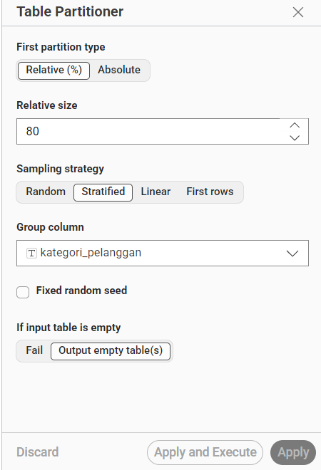
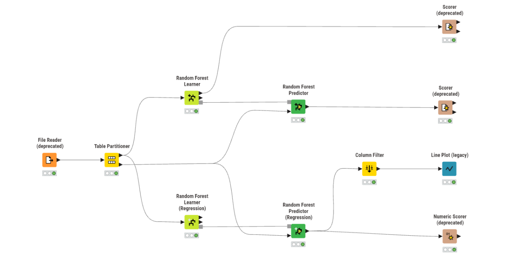
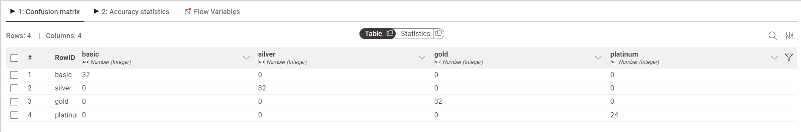
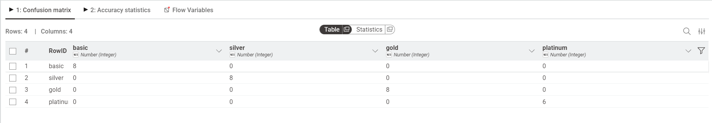
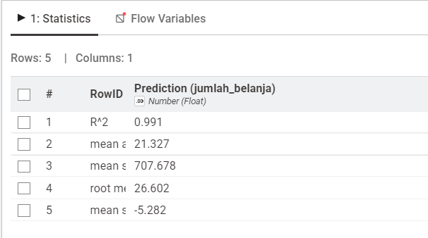

# Analisis Data Menggunakan Random Forest

## Dataset

Dataset yang digunakan adalah **Dataset Pelanggan** yang berisi informasi profil pelanggan untuk diklasifikasikan ke dalam kategori loyalitas dan diprediksi jumlah belanjaannya.

Dataset ini memiliki **150 baris data**, **5 fitur** (seluruhnya numerik), dan **1 label** bernama `kategori_pelanggan` yang memiliki 4 nilai kelas.

Berikut seluruh fitur beserta keterangannya:

| No | Nama Fitur          | Tipe Data | Deskripsi                                  |
|----|---------------------|-----------|--------------------------------------------|
| 1  | umur                | Numerik   | Usia pelanggan (tahun)                     |
| 2  | penghasilan         | Numerik   | Penghasilan bulanan pelanggan (dalam ribuan)|
| 3  | skor_kepuasan       | Numerik   | Skor kepuasan pelanggan (0–100)            |
| 4  | frekuensi_belanja   | Numerik   | Jumlah transaksi belanja per bulan         |
| 5  | jumlah_belanja      | Numerik   | Total jumlah belanja per bulan             |
| 6  | kategori_pelanggan  | **Label** | Kategori loyalitas pelanggan               |

Kelas pada kolom `kategori_pelanggan` terdiri dari 4 nilai:

| Kategori | Jumlah Data | Keterangan                       |
|----------|-------------|----------------------------------|
| basic    | 40          | Pelanggan dengan profil dasar    |
| silver   | 40          | Pelanggan tingkat menengah       |
| gold     | 40          | Pelanggan tingkat atas           |
| platinum | 30          | Pelanggan dengan loyalitas tinggi|

Berikut ringkasan statistik dataset:

| Fitur             | Min    | Max    | Rata-rata |
|-------------------|--------|--------|-----------|
| umur              | 21     | 60     | 39.5      |
| penghasilan       | 3.200  | 12.740 | 7.633     |
| skor_kepuasan     | 70     | 100    | 82.87     |
| frekuensi_belanja | 5      | 44     | 23.5      |
| jumlah_belanja    | 210    | 1.124  | 648.07    |

---

## Transformasi Data

Dataset ini seluruhnya bertipe **numerik** sehingga tidak memerlukan proses encoding kategorikal. Namun, karena fitur memiliki skala yang berbeda-beda (contoh: `penghasilan` bernilai ribuan, sementara `skor_kepuasan` hanya 0–100), proses **normalisasi atau standarisasi** dapat diterapkan jika diperlukan.

Pada implementasi KNIME ini, data langsung diproses tanpa normalisasi karena node **Random Forest Learner** bersifat **tree-based** yang tidak sensitif terhadap perbedaan skala antar fitur.

---

## Partisi

Sebelum dilakukan proses pelatihan model, data dibagi menjadi **data training** dan **data testing** menggunakan node **Table Partitioner** di KNIME.

Pengaturan yang digunakan pada node **Table Partitioner** adalah sebagai berikut:

- **First partition type**: Relative (%)
- **Relative size**: 80% → sebagai **data training**
- **Sampling strategy**: Stratified (menjaga proporsi kelas tetap seimbang)
- **Group column**: `kategori_pelanggan` (kolom target yang dijadikan acuan stratifikasi)
- **Fixed random seed**: Tidak diaktifkan

> Dengan strategi **Stratified**, KNIME memastikan bahwa proporsi kelas `basic`, `silver`, `gold`, dan `platinum` pada data training maupun data testing tetap seimbang sesuai distribusi aslinya.

Hasil pembagian data:



| Partisi       | Persentase | Jumlah Data (estimasi) |
|---------------|------------|------------------------|
| Training      | 80%        | 120 data               |
| Testing       | 20%        | 30 data                |

---

## Implementasi KNIME

### Alur Workflow KNIME

Berikut urutan node yang digunakan dalam workflow KNIME untuk implementasi Random Forest:

```
File Reader
      ↓
Table Partitioner  →  [Training Data 80%]  →  Random Forest Learner (Classification)  →  Random Forest Predictor  →  Scorer (deprecated)
                   →  [Testing Data 20%]   →  ↗                                        ↗
                                           →  Random Forest Learner (Regression)    →  Random Forest Predictor (Regression)  →  Column Filter  →  Line Plot (legacy)
                                                                                                                              →  Numeric Scorer (deprecated)
```



Penjelasan masing-masing node:

| Node                                    | Fungsi                                                                        |
|-----------------------------------------|-------------------------------------------------------------------------------|
| File Reader                             | Membaca dataset dari file `.csv`                                              |
| Table Partitioner                       | Membagi data menjadi data training (80%) dan data testing (20%)               |
| Random Forest Learner (Classification)  | Melatih model Random Forest untuk klasifikasi `kategori_pelanggan`            |
| Random Forest Predictor (Classification)| Memprediksi kategori pelanggan pada data testing                              |
| Scorer (deprecated)                     | Mengevaluasi performa klasifikasi (confusion matrix & akurasi)                |
| Random Forest Learner (Regression)      | Melatih model Random Forest untuk regresi `jumlah_belanja`                    |
| Random Forest Predictor (Regression)    | Memprediksi nilai `jumlah_belanja` pada data testing                          |
| Column Filter                           | Memilih kolom yang relevan untuk ditampilkan pada visualisasi                 |
| Line Plot (legacy)                      | Menampilkan grafik perbandingan nilai aktual vs hasil prediksi regresi        |
| Numeric Scorer (deprecated)             | Mengevaluasi performa regresi (R², MAE, MSE, RMSE)                           |

---

## Random Forest — Klasifikasi

### Apa itu Random Forest?

**Random Forest** adalah algoritma machine learning yang bekerja dengan membuat banyak **Decision Tree** secara acak, lalu menggabungkan hasilnya untuk mendapatkan prediksi yang lebih akurat dan stabil.

> Analoginya seperti **voting**: daripada bertanya kepada satu orang ahli, kita bertanya kepada 100 orang ahli yang berbeda, lalu mengambil jawaban yang paling banyak dipilih.

Keunggulan Random Forest dibandingkan Decision Tree tunggal:
- Lebih tahan terhadap **overfitting**
- Lebih **akurat** karena menggabungkan banyak model
- Dapat menangani dataset dengan banyak fitur

### Konfigurasi Node Random Forest Learner (Classification)

| Parameter                  | Nilai               | Keterangan                                         |
|----------------------------|---------------------|----------------------------------------------------|
| Class column               | `kategori_pelanggan`| Kolom target yang ingin diprediksi                 |
| Number of models           | (default)           | Jumlah Decision Tree yang dibangun                 |
| Split criterion            | (default)           | Metode pemilihan fitur terbaik di setiap split     |
| Sampling with replacement  | Aktif               | Setiap pohon dilatih dengan sampel acak (bagging)  |

### Hasil Confusion Matrix — Data Training

Data training menghasilkan confusion matrix sebagai berikut:



|          | basic | silver | gold | platinum |
|----------|-------|--------|------|----------|
| **basic**    | 32    | 0      | 0    | 0        |
| **silver**   | 0     | 32     | 0    | 0        |
| **gold**     | 0     | 0      | 32   | 0        |
| **platinum** | 0     | 0      | 0    | 24       |

> Seluruh data training diklasifikasikan dengan benar tanpa ada kesalahan prediksi.

**Cara membaca confusion matrix:**
- Setiap **baris** mewakili kelas **aktual** (data asli)
- Setiap **kolom** mewakili kelas **prediksi** model
- Angka pada **diagonal** (kiri atas ke kanan bawah) = prediksi **benar**
- Angka di **luar diagonal** = prediksi **salah**

**Perhitungan akurasi data training:**

```
Total benar = 32 + 32 + 32 + 24 = 120
Total data  = 120
Akurasi     = 120 / 120 × 100% = 100%
```

### Hasil Confusion Matrix — Data Testing

Data testing menghasilkan confusion matrix sebagai berikut:



|          | basic | silver | gold | platinum |
|----------|-------|--------|------|----------|
| **basic**    | 8     | 0      | 0    | 0        |
| **silver**   | 0     | 8      | 0    | 0        |
| **gold**     | 0     | 0      | 8    | 0        |
| **platinum** | 0     | 0      | 0    | 6        |

> Model berhasil memprediksi seluruh data testing dengan benar.

**Perhitungan akurasi data testing:**

```
Total benar = 8 + 8 + 8 + 6 = 30
Total data  = 30
Akurasi     = 30 / 30 × 100% = 100%
```

---

## Random Forest — Regresi

### Perbedaan Klasifikasi dan Regresi

| Aspek         | Klasifikasi                         | Regresi                                      |
|---------------|-------------------------------------|----------------------------------------------|
| Output        | Kelas/kategori (basic, silver, ...) | Nilai numerik (jumlah belanja)               |
| Target kolom  | `kategori_pelanggan`                | `jumlah_belanja`                             |
| Evaluasi      | Akurasi, Confusion Matrix           | R², MAE, RMSE                                |

### Konfigurasi Node Random Forest Learner (Regression)

| Parameter     | Nilai             | Keterangan                                         |
|---------------|-------------------|----------------------------------------------------|
| Target column | `jumlah_belanja`  | Kolom yang ingin diprediksi nilainya               |

### Hasil Evaluasi Regresi — Numeric Scorer

Berikut hasil evaluasi model regresi Random Forest:



| Metrik                    | Nilai     |
|---------------------------|-----------|
| R² (R-Squared)            | 0.991     |
| Mean Absolute Error (MAE) | 21.327    |
| Mean Squared Error (MSE)  | 707.678   |
| Root Mean Squared Error (RMSE) | 26.602 |
| Mean Signed Error (MSE)   | -5.282    |

**Penjelasan masing-masing metrik:**

- **R² = 0.991** → Model mampu menjelaskan **99.1%** variasi data aktual. Nilai mendekati 1 berarti model sangat baik.
- **MAE = 21.327** → Rata-rata selisih absolut antara prediksi dan nilai aktual sebesar **±21.327**.
- **RMSE = 26.602** → Akar dari rata-rata kuadrat error. Lebih sensitif terhadap error besar dibanding MAE.
- **Mean Signed Error = -5.282** → Model cenderung sedikit **memprediksi lebih rendah** dari nilai aktual (underprediction).

> Nilai **R² = 0.991** menunjukkan bahwa model Random Forest Regression memiliki performa yang **sangat baik** dalam memprediksi jumlah belanja pelanggan.

---

## Kesimpulan

Dari hasil implementasi Random Forest menggunakan KNIME pada dataset pelanggan, diperoleh kesimpulan sebagai berikut:

**Klasifikasi:**
- Model Random Forest berhasil mengklasifikasikan kategori pelanggan (`basic`, `silver`, `gold`, `platinum`) dengan **akurasi 100%** baik pada data training maupun data testing.
- Tidak ada satupun data yang salah diklasifikasikan, yang menunjukkan bahwa fitur-fitur dalam dataset (umur, penghasilan, skor kepuasan, frekuensi belanja) memiliki **pola yang sangat jelas** untuk membedakan tiap kategori pelanggan.

**Regresi:**
- Model Random Forest Regression berhasil memprediksi `jumlah_belanja` dengan nilai **R² = 0.991**, yang menandakan prediksi sangat mendekati nilai aktual.
- Nilai RMSE sebesar **26.602** tergolong kecil mengingat rentang nilai `jumlah_belanja` berkisar antara 210 hingga 1.124.

**Perbandingan dengan Decision Tree:**
- Random Forest menghasilkan performa yang lebih stabil karena menggabungkan banyak pohon keputusan, sehingga lebih tahan terhadap noise dan overfitting dibandingkan Decision Tree tunggal.